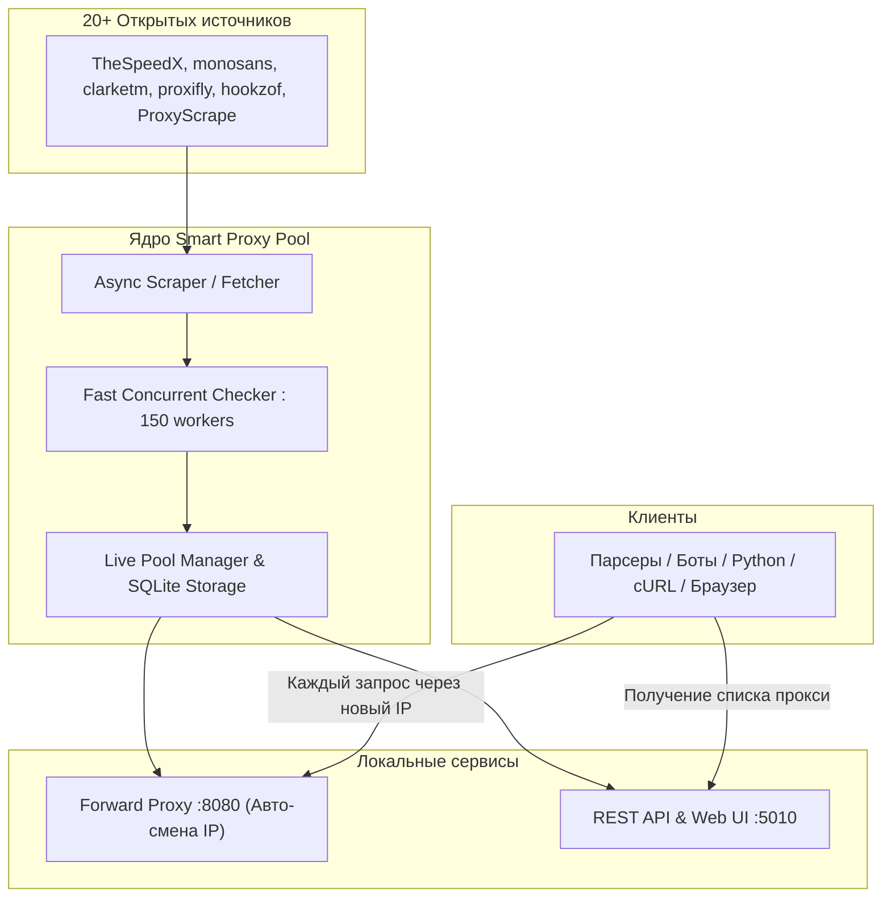

# Smart Proxy Pool

[](https://opensource.org/licenses/MIT)
[](https://python.org/)
[](./Dockerfile)
[](./CONTRIBUTING.md)

Автоматический сервис для непрерывного сбора, валидации и ротации бесплатных прокси (HTTP / SOCKS4 / SOCKS5) с локальным сервером перенаправления и Web Dashboard.

---

## Архитектура



---

## Возможности

* **Непрерывный сбор прокси**: парсинг 20+ публичных репозиториев и API с автоматической дедупликацией.
* **Сверхбыстрая валидация**: параллельный асинхронный чекер (150+ потоков) отсеивает медленные (>3.5 сек) и мертвые узлы.
* **Локальный Forward Proxy (`http://127.0.0.1:8080`)**:
  * **Авто-ротация IP**: каждый новый исходящий запрос идет через новый случайный живой прокси из пула.
  * **Seamless Retry**: при сбое соединения запрос автоматически повторяется через другой рабочий прокси без ошибки для клиента.
  * Поддержка протоколов HTTP и HTTPS (`CONNECT` туннелирование).
* **REST API & Web Dashboard (`http://127.0.0.1:5010`)**:
  * Графический веб-интерфейс со статистикой пула и таблицей задержек.
  * Эндпоинты `/get`, `/all`, `/count`, `/status`.
* **Zero Maintenance**: автоматическая перепроверка пула каждые 5 минут и докачка свежих прокси каждые 10 минут.
* **Docker & Compose**: развертывание в 1 команду.

---

## Быстрый старт

### Вариант 1: Запуск через Docker Compose (Рекомендуется)

1. Клонируйте репозиторий:
```bash
git clone https://github.com/nadaroot/freeproxy.git
cd freeproxy
```

2. Запустите контейнер:
```bash
docker compose up -d
```

- Локальный ротатор прокси доступен на: `http://localhost:8080`
- Web Dashboard и REST API доступны на: `http://localhost:5010`

---

### Вариант 2: Локальный запуск (Python)

#### Требования
* Python 3.10+

1. Установите зависимости:
```bash
python3 -m venv venv
source venv/bin/activate  # На Windows: venv\Scripts\activate
pip install -r requirements.txt
```

2. Запустите сервис:
```bash
python main.py
```

---

## Примеры использования ротатора

### 1. Python (`requests`)

Просто укажите `http://127.0.0.1:8080` в качестве прокси — каждый запрос будет выполняться с нового IP-адреса:

```python
import requests

proxies = {
    "http": "http://127.0.0.1:8080",
    "https": "http://127.0.0.1:8080"
}

for i in range(5):
    resp = requests.get("http://httpbin.org/ip", proxies=proxies, timeout=10)
    print(f"Запрос #{i+1} -> IP:", resp.json()["origin"])
```

### 2. cURL

```bash
curl -x http://127.0.0.1:8080 http://httpbin.org/ip
```

### 3. Node.js (`axios` / `fetch`)

```javascript
import axios from 'axios';
import { HttpsProxyAgent } from 'https-proxy-agent';

const agent = new HttpsProxyAgent('http://127.0.0.1:8080');

const response = await axios.get('http://httpbin.org/ip', {
    httpAgent: agent,
    httpsAgent: agent
});

console.log('Rotated IP:', response.data.origin);
```

### 4. Go

```go
package main

import (
	"fmt"
	"io"
	"net/http"
	"net/url"
)

func main() {
	proxyUrl, _ := url.Parse("http://127.0.0.1:8080")
	client := &http.Client{Transport: &http.Transport{Proxy: http.ProxyURL(proxyUrl)}}

	resp, _ := client.Get("http://httpbin.org/ip")
	body, _ := io.ReadAll(resp.Body)
	fmt.Println(string(body))
}
```

---

## REST API

| Метод | Эндпоинт | Описание | Формат ответа |
| :--- | :--- | :--- | :--- |
| `GET` | `/` | Web Dashboard со статистикой пула | HTML |
| `GET` | `/get` | Получить 1 случайный живой прокси | Plain text / `?format=json` |
| `GET` | `/all` | Список всех активных проверенных прокси | JSON / `?format=text` |
| `GET` | `/count` | Количество живых прокси в пуле | JSON |
| `GET` | `/status` | Статус сервиса, uptime и порты | JSON |

### Фильтрация по протоколу
Вы можете запросить только определенный тип прокси:
```bash
curl "http://127.0.0.1:5010/get?protocol=socks5"
curl "http://127.0.0.1:5010/all?protocol=http"
```

---

## Переменные окружения

| Переменная | По умолчанию | Описание |
| :--- | :--- | :--- |
| `PROXY_PORT` | `8080` | Порт локального ротирующего Forward Proxy |
| `API_PORT` | `5010` | Порт REST API и Web Dashboard |
| `MAX_CONCURRENT_CHECKS` | `150` | Количество одновременных потоков проверки |
| `CHECK_TIMEOUT` | `3.5` | Таймаут проверки прокси (сек) |
| `FETCH_INTERVAL_SECONDS` | `600` | Интервал сбора новых прокси (сек) |
| `RECHECK_INTERVAL_SECONDS` | `300` | Интервал перепроверки пула (сек) |

---

## Лицензия

Проект распространяется под лицензией MIT. Подробнее см. в файле [LICENSE](./LICENSE).
